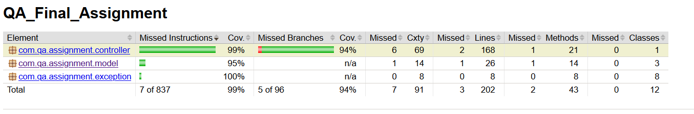

# Documentation

## Sprint Backlog

| No   | Branch Name | Title         | Description  | Estimate| 
| ---- | ----|:-------------| :------------| :---|  
| 1 |initial_documentation| Initial documentation| Detail the documentation by explaining the sprint backlog, TDD, Test Coverage Metric, Team Version Control and Code Reviews | 2 |
| 2|base_model| Create base model |   Create entities (Survey, Questions and SurveyResponse) and Controller class. Add test class for the Controller class | 2 | 
| 3|survey_features| Create Survey components/features | Create a survey, add a question to a survey, get a list of all surveys, get a survey by name + associated tests| 3 |
| 4| survey_response_features| Create Survey Response components/features | Create a survey response, add an answer to a survey response, get all responses for a specific survey + associated tests| 3 |
| 5|survey_calculation| Summary calculation for a survey| Get the average, standard deviation, minimum and maximum score + associated tests| 5 |
| 6|survey_question_calculation| Summary calculation for a question on a survey| Get the average, standard deviation, minimum and maximum score + associated tests| 5 |

### How these estimates were decicded? 
We use the Fibonacci sequence to assign a point value to a feature. It is important to say that these numbers represent relative size, not time.  
Estimates were  based on 3 criteria: technical complexity, decision-making, quantity of work. 
- Task 1 - As this task is not a development task, there is no technical complexity. However, the task requires an investigation work that implies some decision making.
- Task 2 - This task does not involve any calculation or business logic. As a result, we can consider it a low technical complexity. However, there is a need to decide on the architecture, which involves some decision making. There are not many classes, as a result, we can tell it is low quantity of work.
- Task 3 / 4 - Those tasks involve some business logic. Which can decently be complicated. The amount of work is average and we do not expect much decision making as everything is documented in the subject.
- Task 5 - This task involves some calculation, which may require some extra testing and ensuring it does work correctly. Which qualifies it to be an important complexity task. Although, it involves low decision making as the calculation method is known. The amount of work should be low as it does not require to touch a lot of different areas.
- Task 6 - Similar to task no 5. However, we do note an extra complexity in order to retrieve the question from all the SurveyResponse.

### How velocity is calculated?
Velocity is the measure of work completed by the development team within each sprint. Velocity is calculated at the end of the Sprint by summing up the points for all fully completed User Stories. <br/>
For example, during this sprint, I have done a total of 20 points. At the start of the next Sprint, once all the tasks are estimated, I will be able to know that the sum of points of all the tickets 
must not exceed 20 as it is the baseline. If at the end of the sprint, there is still some time left, I will move the baseline to 23 points in order to adjust the velocity.<br/>
On the other hand, if I do not manage to complete all the tickets, then, the sprint will be reduced from the number of tickets left.<br/>
In order to illustrate that, we can look back at the initial sprint backlog. If during the sprint I would not have been able to complete the following tickets: 
survey_calculation, survey_question_calculation. Then, my velocity would be 10 (initial_documentation + base_model + survey_features + survey_response_features).<br/>
This means that the following sprint would only include survey_calculation and survey_question_calculation as their total story points are 10.

## Test Driven Development
The best illustration of the TDD approach in my project is composed by those 2 commits:

| Commit | Description |
| ---- | ----|
| 88ce442f64a7fcd249b2ed885bdb8d3e240544bf | Prior starting the implementation of the SurveyReponses, I tried to think about all the use cases that I would need to take into account. This resulted in creating the tests methods and their implementation first. As well as the method signature for the SurveyResponses. |
| 8c84e698768c1c5546e3e7b73f286129d0a4bd4e | Once the tests methods were created and committed. I have implemented the business logic of the SurveyReponses. The objective was to have the tests passing one by one, taking into account each cases.  |

## Test Coverage Metric 
A code coverage tool should provide the means not only to measure code coverage, but also to enforce it.
JaCoCo is currently the most actively maintained and sophisticated code coverage measurement tool for the Java ecosystem.

### How to run JaCoCo  
Inside *build.gradle*, apply the jacoco plugin  
```grrovy
apply plugin: 'jacoco'
```
Add the following in order to generate the test report every build
```groovy
test {
    finalizedBy jacocoTestReport // report is always generated after tests run
}

jacocoTestReport {
    dependsOn test // tests are required to run before generating the report
}
```
From the project's directory, run:
```
./gradlew clean build
```
This, will allow to build the project, run the tests and generate the following report from Jacoco:



The full report can be found under: project_directory/build/reports/jacoco/test/html

## Team Version Control

### Branching Naming Convention
- Feature:  
Example: *feature/initial_documentation*
- Bug Fix:    
Example: *bugfix/branch_name_x* 
- Hot Fix:  
Example: *hotfix/branch_name_x*

### Branches used 

| Branch | Description |
| ---- | ----|
| *master* | Code that represents the latest released version of the product. This is the code that users are currently using. It must be as stable as possible. Bugs found by users should be fixed from this branch and merged back to both develop and master as hotfixes. |
| *develop* | Code that is currently in development during the sprint. |
| *feature/initial_documentation* | Contains the first batch of documentation for the project. Creating the README file, looking for relevant documentation about TDD, Test Coverage, Code Review process and sprint planning methodology. |
| *feature/base_model* | Contains the base class structure representing the application's model as well as the Controller and ControllerTest classes|
| *feature/survey_calculation* | Contains tests methods and business logic methods to perform calculation on Survey and Survey questions | 
| *feature/survey_features* | Contains the business logic related to the Surveys (Add a Survey, Add a question to a Survey etc..) and the test methods associated to the functional cases. |
| *feature/survey_response_features* | Contains the business logic related to the SurveyReponses (Add a SurveyReponse to a Survey, give answers to questions from the Survey). Also contains all the tests related to the methods. |
| *feature/survey_question_calculation*| Contains the implementation of calculation based on questions and their associated test methods.|
| *feature/code_cleanup_1* | Contains the final version of the documentation for the sprint as well as some more ambitious optimisations on the code that were too big to be made during code reviews (model change for example). |
| *bugfix/fixed_merge_issue_with_master* | During the final merge with master, some of my classes were removed. As a result, I have opened a bugfix branch in order to fix the bug. |

## Code Review Checklist
- Are unit tests and integrations passing?
- Does this Pull Request do what it is supposed to do? 
- Is the code readable/clear?
- Can the code be shorter/simpler? 
- Are changes covered by test? 
- Is the same code duplicated more than twice?
- Is this function or class too big? If yes, is the function or class having too many responsibilities?
- Are there any best practices, design patterns or language-specific patterns that could substantially improve this code?
- Is the code documented enough?

### Pull request examples
- https://github.com/jbul/QA_Final_Assignment/pull/3
- https://github.com/jbul/QA_Final_Assignment/pull/4

## References
- https://reflectoring.io/jacoco/
- https://medium.com/@taingmeng/what-you-should-look-out-for-when-you-review-pull-request-3f2d95a50ba9 